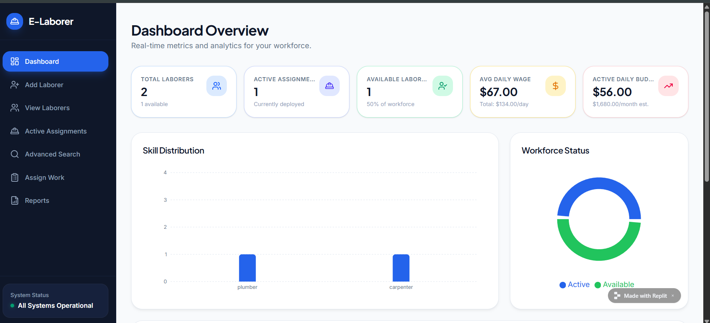
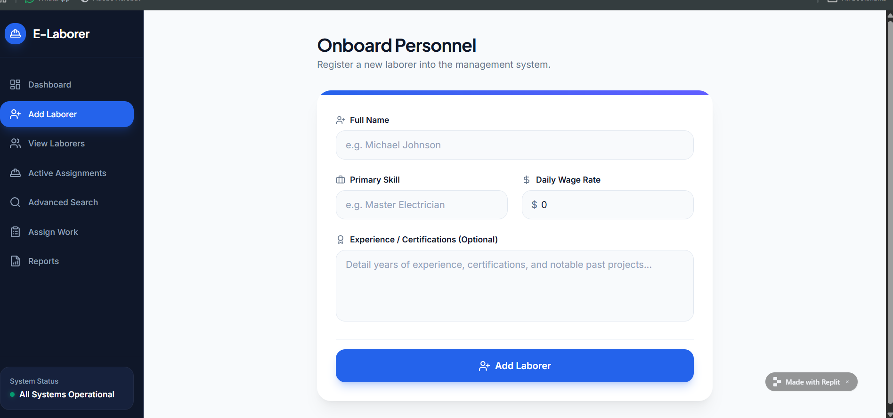
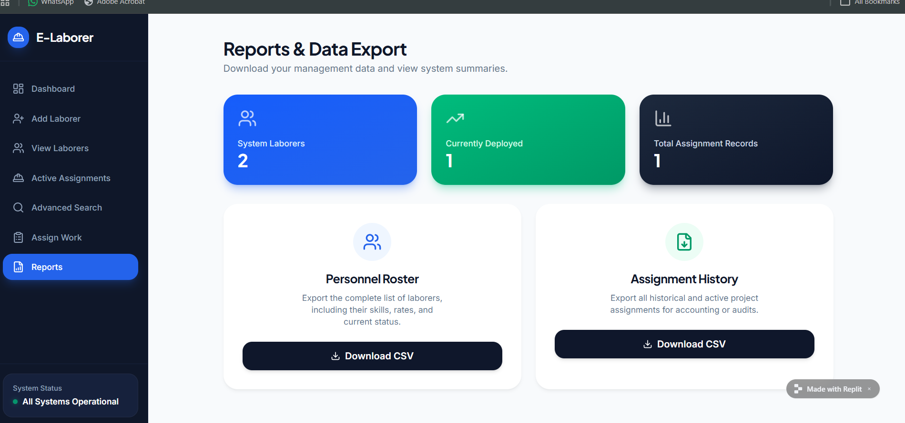

# E-Laborer Management System 👷‍♂️

E-Laborer Management System is a **full-stack workforce management application** designed to manage labor workers, assignments, and availability efficiently.

This system helps contractors or administrators **organize labor records, assign work, track availability, and manage labor data through a dashboard interface**.

---

## 🚀 Features

* Laborer Registration
* View Laborer Details
* Update Laborer Information
* Delete Laborer Records
* Search Laborers by Skill or Name
* Assign Work to Laborers
* Track Active Assignments
* Dashboard Statistics
* Laborer Availability Status

---

## 🛠 Tech Stack

### Backend

* Java
* Spring Boot
* Spring Data JPA
* Hibernate
* REST API

### Frontend

* React.js
* HTML
* CSS
* JavaScript

### Database

* MySQL

### Tools

* Git
* GitHub
* Replit
* Postman

---

## 📁 Project Structure

```text
E-Laborer-Management-System
│
│── backend/
│   ├── src/main/java/com/elaborer/
│   │   ├── controller/
│   │   ├── service/
│   │   ├── repository/
│   │   └── entity/
│   │
│   └── src/main/resources/
│       └── application.properties
│
│── frontend/
│   ├── src/
│   ├── public/
│   └── package.json
│
│── screenshots/
│── README.md
```

---

## 🔗 API Documentation

The backend exposes REST APIs to manage laborer records and assignments.

### 👷 Laborer APIs

| Method | Endpoint             | Description            |
| ------ | -------------------- | ---------------------- |
| POST   | `/api/laborers`      | Add new laborer        |
| GET    | `/api/laborers`      | Get all laborers       |
| GET    | `/api/laborers/{id}` | Get laborer by ID      |
| PUT    | `/api/laborers/{id}` | Update laborer details |
| DELETE | `/api/laborers/{id}` | Delete laborer         |

---

### 🔎 Search API

| Method | Endpoint                      | Description             |
| ------ | ----------------------------- | ----------------------- |
| GET    | `/api/laborers/search?skill=` | Search laborer by skill |

---

## 📊 Dashboard Statistics

The dashboard displays:

* Total Laborers
* Active Assignments
* Available Laborers
* Labor Distribution by Skill

---

## 📘 API Testing (Postman)

The APIs can be tested using **Postman** or any REST client.

Example request:

POST /api/laborers

Example response:

```json
{
"id": 1,
"name": "Ramesh",
"skill": "Mason",
"dailyWage": 700,
"assignedWork": "Building Construction"
}
```

---

## 📸 Application Screenshots

### Dashboard



### Add Laborer Page



### Laborer List



---

## ⚙️ How to Run the Project

### Backend

1. Clone the repository
2. Open the project in IntelliJ / Eclipse
3. Configure MySQL database
4. Run the Spring Boot application


## 🌐 Live Demo

Access the live application here:

🔗 https://laborer-manager--gauravaswale65.replit.app/

---

## 🗂 Database Design

The database stores laborer information including:

* ID
* Name
* Skill
* Experience
* Assigned Work
* Daily Wage
* Status

---

## 👨‍💻 Developer

**Gaurav Aswale**

Software Developer | Full Stack Java Developer

📧 Email: [gauravaswale65@gmail.com](mailto:gauravaswale65@gmail.com)
📞 Phone: +91 9370320225

🔗 LinkedIn:
https://www.linkedin.com/in/gaurav-aswale-65566531b/

🐙 GitHub:
https://github.com/GauravAs2003
